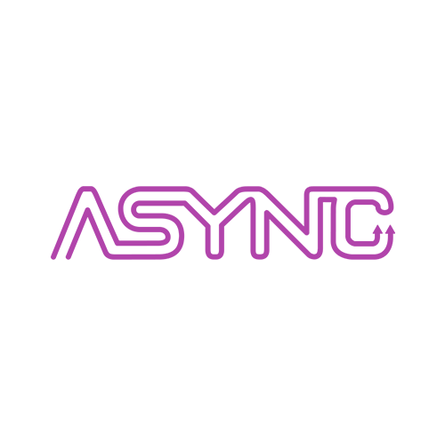
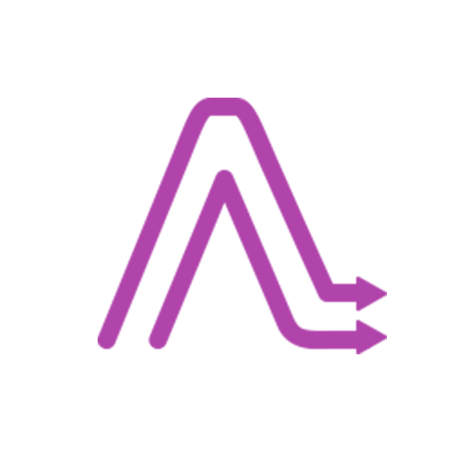
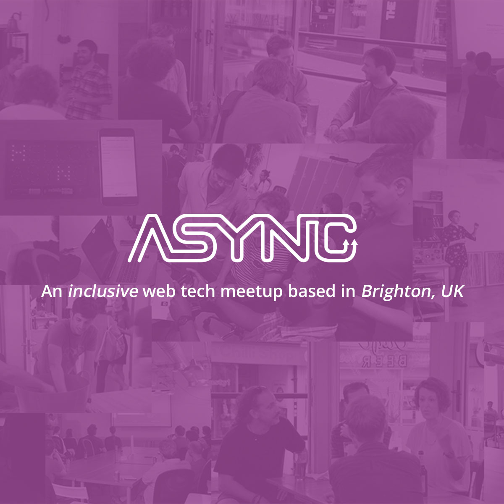
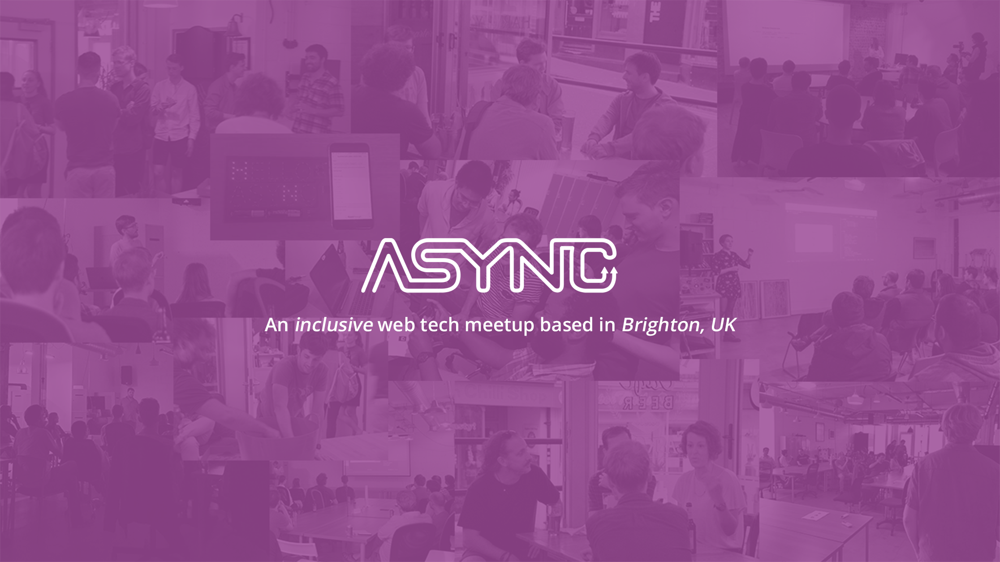

This repository contains Async brand assets and guidelines. Feel free to use and customize these assets for your articles, talks, websites, and anything else you can think of.

- [Logo](#logo)
- [Colours](#colours)
- [Fonts](#fonts)

## Logo

The Async logo was designed and built by [Jake 'Sid' Smith](https://twitter.com/jakesidsmith) (<https://github.com/jakesidsmith>). This work and all content on our website are licensed under [Creative Commons Attribution 3.0 Unported (CC BY 3.0)
](https://creativecommons.org/licenses/by/3.0/).

### Default

| Default                              | Inverse                                    |
| ------------------------------------ | ------------------------------------------ |
|  |  |

### Icon

| Default                                    | Inverse                                          |
| ------------------------------------------ | ------------------------------------------------ |
|  |  |

### Social

| Profile                                           | Profile Icon                                                 |
| ------------------------------------------------- | ------------------------------------------------------------ |
|  |  |

| Open Graph                                      | Cover                                 |
| ----------------------------------------------- | ------------------------------------- |
|  |  |

## Colours

| Colour    | HEX value                                                          |
| --------- | ------------------------------------------------------------------ |
| Primary   |  `#B144AB` |
| Secondary |  `#E97223` |
| Tertiary  |  `#0DA1B8` |
| Success   |  `#2DA73C` |
| Error     |  `#E35050` |

| Monochrome | HEX value                                              |
| ---------- | ------------------------------------------------------ |
| Darkest    |  `#333` |
| Medium     |  `#AAA` |
| Light      |  `#CCC` |
| Lightest   |  `#FFF` |

## Fonts

### Header


```css
font-family: 'Varela Round', helvetica, arial, sans-serif;
```

### Body


```css
font-family: 'Open Sans', helvetica, arial, sans-serif;
```
